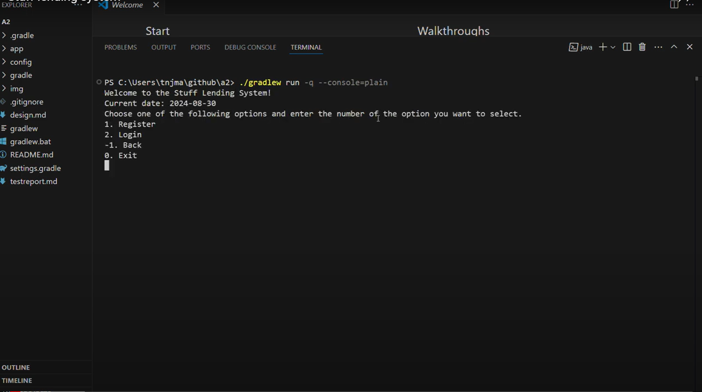

# Stuff Lending System

The **Stuff Lending System** is a console application built with Java and Gradle using object-oriented principles. This system allows members to lend their belongings in exchange for credits, which can be used to borrow items from others. The application also tracks the location of items at any given time.

## Features

### Primary Actors

- **Member**
  - Register possessions in the system and earn credits for each listing.
  - Lend items from other members using credits.
  - Responsible for returning items within the agreed timeframe.

- **System Administrator**
  - Manages overall system functionality.
  - Provides administrative oversight, including tracking item listings, membership records, and the day counter.

### Supporting Actors

- **Member Validation Service**
  - Ensures unique member registration by validating identity.
  - Checks for email and phone number uniqueness.

### Use Cases

1. **Authenticate**
   - A person authenticates as a role (Member, System Administrator).
   - Handles login and role assignment.

2. **Register Member**
   - A person registers as a member with unique credentials (username, email, and phone number).

3. **Add Item**
   - Members can register items by providing details such as category, name, and description.
   - Members earn 100 credits upon item registration.

4. **Establish Lending Contract and Verify Credit Amount**
   - Members can borrow items if they have enough credits.
   - Credits are transferred from borrower to lender based on the lending contract.

5. **Advance Day Count**
   - Admin can advance the day count.
   - System triggers all lending contracts and processes credit transfers accordingly.

6. **Change Item Information**
   - Members can update item details.

7. **Member Profile Update**
   - Members can update their profile information.

8. **View Member/Item Details**
   - Retrieve and view details of a member or item.

9. **Delete Member**
   - Admin can delete a member and all associated data.

10. **Delete an Item**
    - Members can delete their items from the system.

11. **View Contracts**
    - Members can view details of their borrowing or lending contracts.

12. **List All Members**
    - Admin can view a list of all members with the number of items they own.

## Demo video
[](https://www.youtube.com/watch?v=E7swwvi0ics)

## Building

The build must pass by running the following console command:
```
./gradlew build
```
Note that you should get a report over the quality like:
```
CodeQualityTests > codeQuality() STANDARD_OUT
    0 CheckStyle Issues in controller/App.java
    0 CheckStyle Issues in controller/Simple.java
    0 CheckStyle Issues in model/Simple.java
    0 CheckStyle Issues in view/Simple.java
    0 FindBugs Issues in controller/App.java
    0 FindBugs Issues in model/Simple.java
    0 FindBugs Issues in view/Simple.java
    0 FindBugs Issues in controller/Simple.java
```

## Running
The application should start by running console command:  
```
`./gradlew run -q --console=plain`
```

### License
This project is licensed under the MIT License

### Contact
1. Vanja Maric
- email: maricvanj@gmail.com

2. Tea Sallstedt Elming

3. Sheila Lindqvist