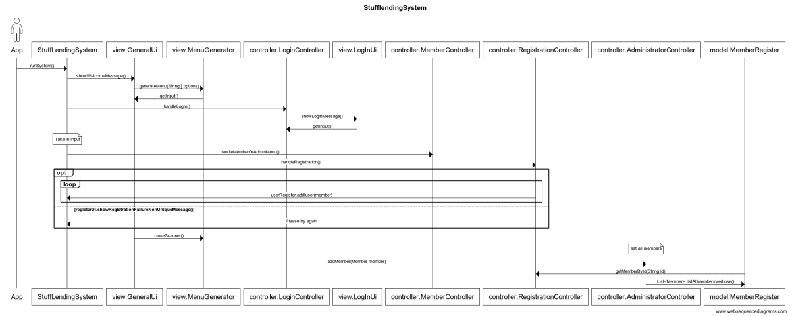
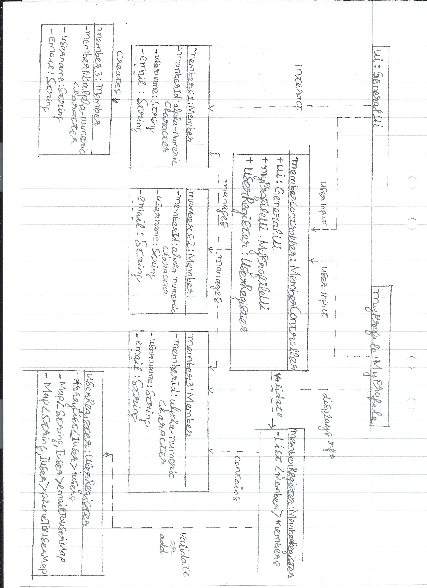

# Boatclub OO-Design
This document describes the design according to the requirements presented in assignment 2.

## Architectural Overview
The application uses the model-view-controller (MVC) architectural pattern. The view is passive and gets called from the controller. The view may only read information from the model, not directly change it.

## Detailed Design
### Class Diagram
Please provide at least one class diagram according to the assignment requirments.
.png) (updated - note that association names describe navigablity of associations.)
For previous class diagram, plese see .jpeg)

### Sequence Diagram
Please provide at least one sequence diagram according to the assignment requirments.

### Object Diagram
Please provide at least one sequence diagram according to the assignment requirments.
 (updated - The object diagram represents a snapshot of the specific moment when a third Member is added to the system that already has two existing Member objects.)
